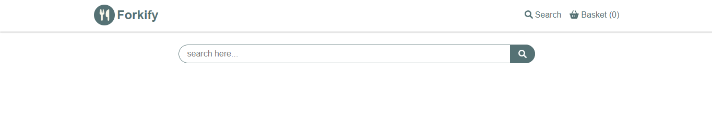
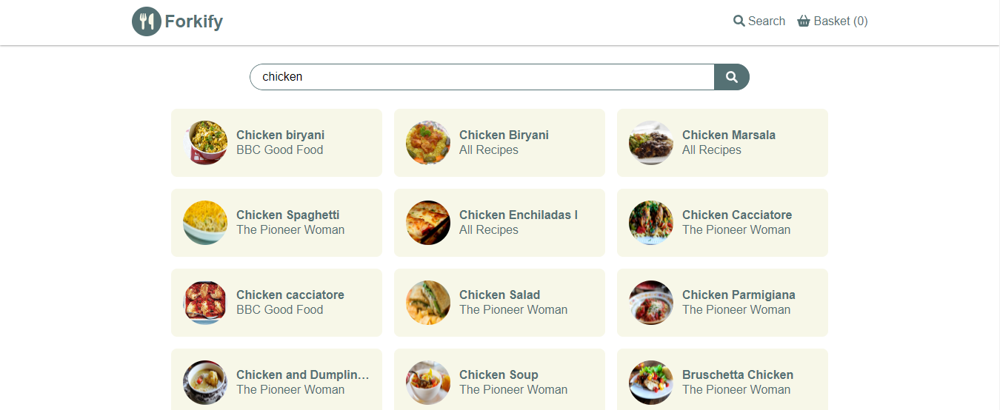
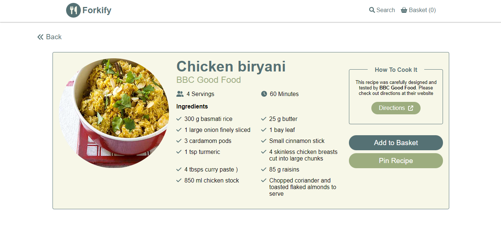
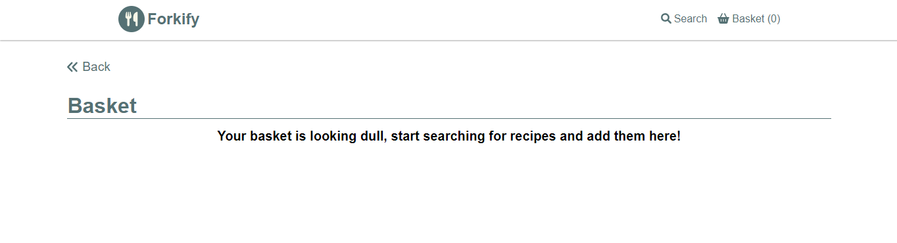
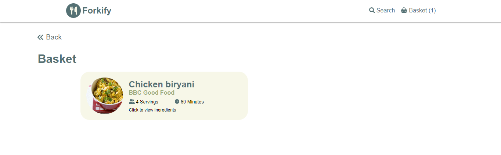
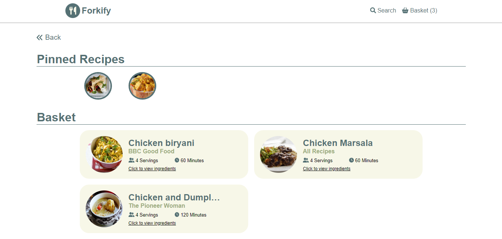
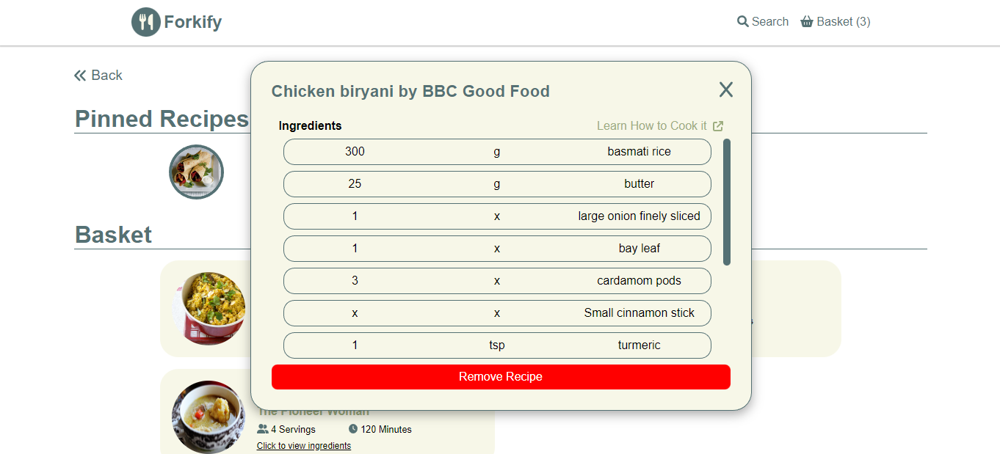

# Forkify Project

## Overview

Forkify is an idea that came from Jonas Schmedtmann's Javascript course. I redesigned and used the following tech stack to develop this project:

- ReactJS
- Redux toolkit
- styled-components
- Storybook
- Forkify API provided by Jonas

Live demo: https://chaaals-forkify-v2.vercel.app/

## Features

Search Feature

- Search
  
- Search Result
  

Selecting Feature (in search)

- Selected Dish
  

Basket Feature

Adding Feature

- Added Recipe
  

Pinning Feature

- Pinned Recipe
  

Selecting Feature (in basket)

- Selected Recipe
  

Removing Recipe

- Removed Recipe (refer to the picture in pinning feature to see removed recipe)
  

Developed with ❤️ by Charles Ching
